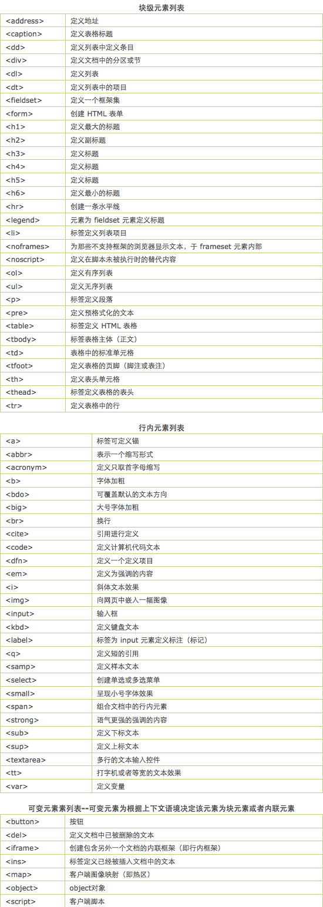

行内元素、块元素和空元素

行内元素特点

1、和其他元素都在一行上；

2、元素的高度、宽度、行高及顶部和底部边距不可设置；

3、元素的宽度就是它包含的文字或图片的宽度，不可改变。 
行内元素在设置 水平方向的padding-left、padding-right、margin-left、margin-right都产生边距效果，但竖直方向的padding-top、padding-bottom、margin-top、margin-bottom却不会产生边距效果。

块级元素特点

1、每个块级元素都从新的一行开始，并且其后的元素也另起一行。（真霸道，一个块级元素独占一行）

2、元素的高度、宽度、行高以及顶和底边距都可设置。

3、元素宽度在不设置的情况下，是它本身父容器的100%（和父元素的宽度一致），除非设定一个宽度。
在html中，、<a>、<label>、<input>、 、 <strong> 和<em>就是典型的行内元素（inline）元素。

块级元素是可以设置宽高的，但是它的实际宽高是本身宽高+padding。block元素要单独占一行。内联元素不单独占一行，给他设置宽高是没有用的。

块级元素和行内元素列表：

空元素

知名的空元素：   
  <input> <link> <meta>
鲜为人知的是： <area> <base> <col> <command> <embed> <keygen> <param> <source> <track> <wbr>